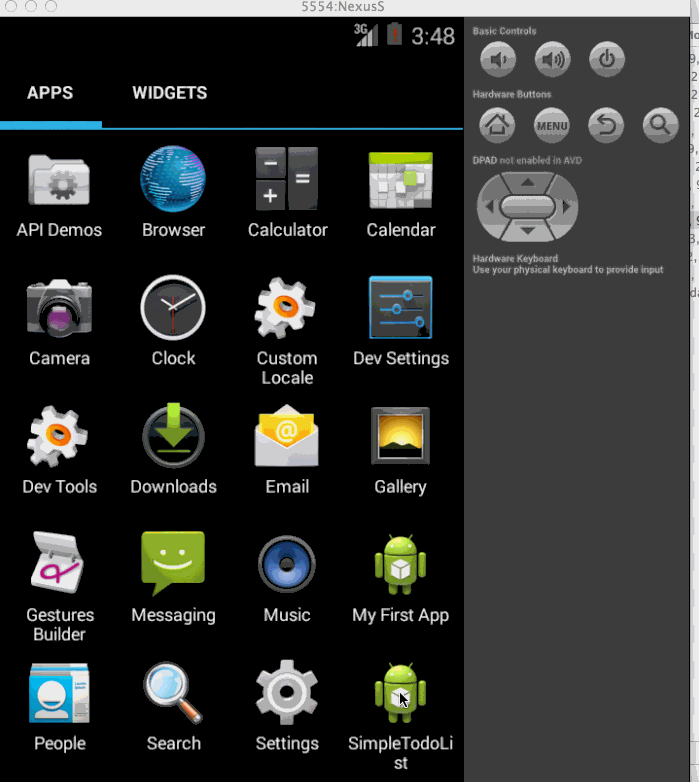

SimpleTodoList
==============

(Sample of your weekly project submission README)

This is the android application for creating and managing a simple todo list

Time spent: 1.5 hours spent in total

Completed user stories:

 * [x] Required: User can look at the existing todo items after opening the app 
 * [x] Required: User can (long) click and delete an item on the todo list 
 * [x] Required: User can create a new item in the list by editing the text and clicking the add button
 
Notes:

* Spent some time going over the troubleshooting eclipse+android set up 
* Went over the video/slides of the todolist tutorial

Walkthrough of all user stories:

GIF created with [LiceCap](http://www.cockos.com/licecap/)
